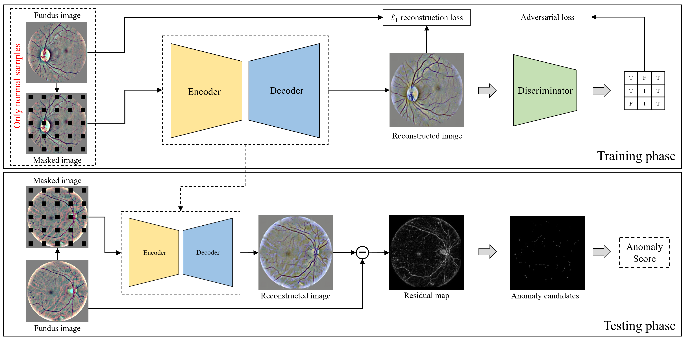

# Lesion2Void

This is the pytorch implementation of the paper:

> Y. Huang, W. Huang, W. Luo and X. Tang, "Lesion2Void: Unsupervised Anomaly Detection in Fundus Images", Proceedings of the IEEE 19th International Symposium on Biomedical Imaging (ISBI), Kolkata, India, March 2022.

We propose an unsupervised anomaly detection framework for diabetic retinopathy (DR) identification from fundus images, named Lesion2Void. Lesion2Void is capable of identifying anomalies in fundus images by only leveraging normal data without any additional annotation during training. We first randomly mask out multiple patches in normal fundus images. Then, a convolutional neural network is trained to reconstruct the corresponding complete images. We make a simple assumption that in a fundus image, lesion patches, if present, are independent of each other and are also independent of their neighboring pixels, whereas normal patches can be predicted based on the information from the neighborhood. Therefore, in the testing phase, an image can be identified as normal or abnormal by measuring the reconstruction errors of the erased patches.

### Usage

Instructions will be updated soon.

